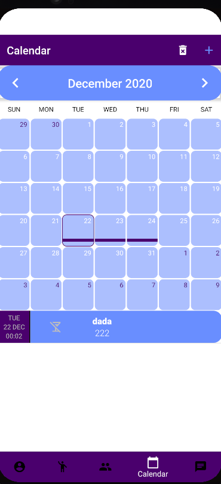

# 
**Техническое задание**

## Название
**Alchotracker**
## Назначение
Мобильное приложение для контроля употребления алкоголя
## Целевая аудитория
Студенты, ~~школьники~~, люди у которых проблемы с контролем употребления алкоголя.

# 
[ Прототип ](https://marvelapp.com/prototype/f8j9fd7/screen/73906707)

# 
Функциональность приложения

1. Календарь с отметками
    * Дни принятия алкоголя в себя
    * Расходы на мероприятия
    * Что и сколько выпил
2. Аутентификация
    * Гугл почта
3. Профиль пользователя
    * Аватарка
    * Статус(описание)
    * Предпочтения в алкоголе
    * Экспорт профиля
4. Таймер
    * Время старта и окончания мероприятия
    * Напоминания о перерывах
5. Push уведомления
    * Отправка пользователю уведомлений
6. Статистика
    * Выдача статистики пользователю (графики, проценты и тд)
    * Сравнения статистики по месяцам
7. Организация
    * Список друзей
    * Создание событий, организатор по списку друзей приглашает людей в чат, где они смогут обозначить что будут пить и сколько это выйдет по деньгам. После чего будет выдан список и кол-во необходимых денег с каждого
8. Для работы с сетью напишем свой сервер

# 
 Описание экранов приложения 

1. Экран **Авторизации**   На этом экране пользователь будет авторизовываться через гугл почту 

2. Экран **Каленадря**   На данном эркане пользователь сможет: 
   - планировать события на определенные дни.
   - получать "быстрые сведения" (кол-во планируемых потраченных денег и тд.) по кликнутому дню.
   - Создание мероприятия с приглашением пользователей из списка друзей
  
  
3. Экран **Профиля**   На этом экране будет находиться профиль пользователя и следующие данные о нем : 
   - Статус(описание пользователя)
   - Аватарка
   - Кол-во друзей
   - Кол-во посещенных им мероприятий

Функции доступные в профиле : 
   - Экспорт профиля
   - Получение списка друзей пользователя

  
4. Экран **Списка друзей**   На этом экране будет рапсологаться список друзей, функционал данного экрана: 
   - По клику на аватарку откроется профиль друга
   - По клику итема друга откроется чат с этим другом
   - Добавление друзей
   - DropDown кнопка, в которой будет переключение на список мероприятий

  
5. Экран **Мероприятий**   На этом экране будет располагаться список меропритяий, функционал данного экрана: 
   - Создать мероприятие
   - Переход в чат по клику на итем мероприятия

  
6. Экран **Чата**   На этом экране будет располагаться самый обычный чат для отправки **текстовых** сообщений

7. Экран **Таймера**   На этом экране будет располагаться таймер, функционал данного экрана:  
    - Старт отчета времени
    - Окончание отчета времени
    - Напоминания о перерывах
    - Напоминания о желательном кол-ве выпитого

  
8. Экран **Статистики**   На этом экране будет расополгаться статистика пользователя  
  

# Схема переходов между экранами

## Команда: CheapCoders
## Разработчики:
    - Овденко Дмитрий
    - Липов Денис
    - Попов Вячеслав
    - Трофимов Дмитрий 
